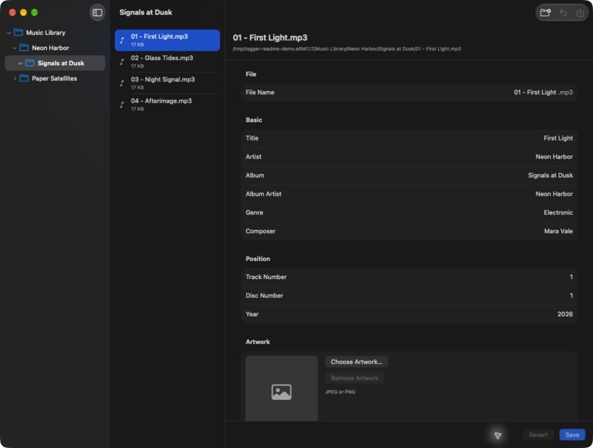

# Tagger

Tagger is a small native macOS app for browsing folders of MP3 and M4A files and editing common music tags.



## Current feature set

- Three-column folder tree, file list, and tag editor
- Single-file editing plus Finder-style multi-selection for batch editing
- Single-file filename editing with the original extension preserved
- Review-first tag suggestions from file names and MusicBrainz
- Mixed-value protection: batch saves change only fields explicitly marked Apply
- ID3v2.3 and ID3v2.4 reading and writing
- MP4 metadata reading and writing for M4A files containing AAC or Apple Lossless (ALAC) audio
- Title, artist, album, album artist, track, disc, year, genre, composer, comment, lyrics, and artwork
- Explicit Save and Revert controls, including Command-S
- Save/discard/cancel confirmation before navigating away, closing, or quitting
- Sandboxed access to user-selected folders, remembered between launches
- Protection against overwriting externally changed files or unsupported or malformed metadata
- Audio bytes and unknown ID3 frames or MP4 atoms preserved when saving supported files

## Auto-tag lookup

Choose **Find Tags…** (Command-Shift-T) for a single selected MP3 or M4A. Suggestions
inferred from its file name appear immediately and work offline. For online
suggestions, review or edit the title, artist, and album search terms, then choose
**Search MusicBrainz**. The terms start with the current editor draft, falling
back to values inferred from the file name. Search terms affect only the lookup;
editing them does not change your tags.

Choose a candidate to compare its suggestions with your current draft. Empty
fields are checked by default; replacing an existing value requires checking its
field. Missing suggestions never erase values. **Apply to Draft** merges only
checked fields into your existing edits. Review or edit that draft, then choose
**Save** (Command-S) to write it to the audio file, or **Revert** to discard all unsaved
changes. Searching, reviewing, applying, and cancelling never write to the file.
Applied suggestions use the same unsaved-change protections as manual edits.

Online lookup is opt-in: opening Find Tags does not contact MusicBrainz. Choosing
Search MusicBrainz sends the displayed title, artist, and album over HTTPS.
Choosing a MusicBrainz candidate may fetch its release details. Tagger does not
upload the audio file, artwork, full file path, comments, or lyrics. Requests share an
application-wide rate limiter. You can use filename suggestions while an online
search is pending or unavailable. MusicBrainz core metadata is made available
under CC0; MusicBrainz remains the source of the lookup results.

## Build and run

The project requires a Swift 6.2-or-newer Xcode toolchain. It currently defaults
to `/Applications/Xcode-beta.app`, then falls back to `/Applications/Xcode.app`.
Set `TAGGER_XCODE_APP` to use another installation.

Open `Tagger.xcodeproj` in Xcode, or run:

```sh
./script/build_and_run.sh
```

Run the test suite with:

```sh
./script/test.sh
```

The checked-in Xcode project is generated from `project.yml`. After changing the project specification, regenerate it with:

```sh
./script/generate_project.sh
```

Verify that the generated project has not drifted from the specification with:

```sh
./script/check_project.sh
```

Current Debug and Release configurations use a placeholder bundle identifier and
local ad-hoc signing. Choose your own reverse-DNS identifier, development team,
and distribution signing settings in `project.yml` before sharing the app.

## Initial-version limitations

Batch editing works on MP3 and M4A files in the currently displayed folder, including mixed selections; use Command-click or Shift-click to select them. Batch saves are sequential, and a failed file does not roll back files already saved. Auto-tag lookup and filename editing are currently single-file only. Auto-tag lookup is text-based and does not fingerprint audio; it proposes title, artist, album, album artist, track, disc, and year while leaving genre, composer, comments, lyrics, artwork, and the filename unchanged. Artwork can be added, replaced, or removed manually in the draft and is written only on Save. The editor exposes one primary artwork image, one comment, plain lyrics, integer track/disc numbers without totals, and a four-digit year. Saving may collapse multiple artwork, comment, or lyrics variants into the displayed primary value, so test with copies before using irreplaceable files.

M4A support edits MP4 tags without converting or re-encoding AAC or ALAC audio. Existing M4A track and disc totals are preserved when changing or clearing the displayed numbers. M4A files must be 512 MB or smaller in this version. DRM-protected files, fragmented containers, files with video, and unsupported or malformed layouts are rejected without modification. MP3 files with unsupported ID3v2.2 tags are also rejected. Renaming preserves the original extension, including its capitalization, and does not convert between formats.

MP3 tag support is provided by the Apache-2.0-licensed AudioMarker 0.1.1 package, pinned exactly for repeatable builds. M4A tag support is implemented in Tagger without additional dependencies.

## License

Tagger is available under the [MIT License](LICENSE).
